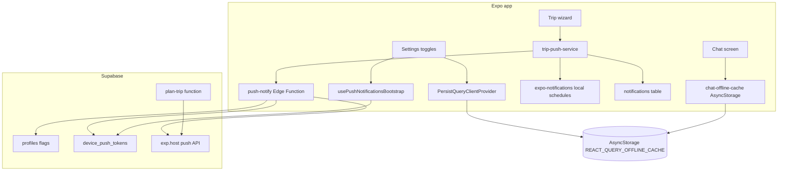

# Push notifications & offline sync

## Architecture



### Push notifications (ON)

1. User enables toggle → `profiles.push_notifications_enabled = true`.
2. App requests OS permission → `expo-notifications` → Expo push token.
3. Token upserted to `device_push_tokens`.
4. Trip wizard / plan regenerate:
   - Inserts in-app rows in `notifications`.
   - Calls `push-notify` Edge Function → Expo Push API → device.
   - Schedules local reminder (day before trip) and stores IDs in AsyncStorage.
5. `plan-trip` Edge Function also sends push when planning completes (server-side).

### Push notifications (OFF)

1. `profiles.push_notifications_enabled = false`.
2. Deletes all rows in `device_push_tokens` for the user.
3. Cancels all scheduled local notifications.
4. Skips DB notification inserts, remote push, and local schedules for new trips.

### Offline sync (ON)

1. `profiles.offline_sync_enabled = true`.
2. React Query caches trips, profile, notifications, auth session to AsyncStorage (7-day max age).
3. Chat history cached per conversation in AsyncStorage.
4. `@react-native-community/netinfo` detects reconnect → invalidates and refetches active queries.
5. Offline banner shown on main tabs when offline.

### Offline sync (OFF)

1. Clears React Query persist blob and chat cache.
2. No dehydration to disk; app needs network for trips/chat lists.

## Libraries

| Package | Role |
|---------|------|
| `expo-notifications` | Permissions, local schedules, Expo push token |
| `expo-device` | Device name for token row |
| `expo-constants` | EAS project ID for push token |
| `@supabase/supabase-js` | Auth, DB, Edge Functions |
| `@tanstack/react-query-persist-client` | Persist query cache |
| `@tanstack/query-async-storage-persister` | AsyncStorage persister |
| `@react-native-async-storage/async-storage` | Auth session, query cache, chat cache, schedule IDs |
| `@react-native-community/netinfo` | Online/offline detection |

## Files changed / added

### Supabase

- `supabase/migrations/20250527100000_device_push_tokens.sql`
- `supabase/functions/_shared/expo-push.ts`
- `supabase/functions/push-notify/index.ts`
- `supabase/functions/plan-trip/index.ts` (push on success)

### Client

- `src/lib/notifications-setup.ts`
- `src/lib/scheduled-notifications-storage.ts`
- `src/lib/push-notify-edge.ts`
- `src/lib/query-persist.ts`
- `src/lib/offline-sync-state.ts`
- `src/lib/offline-query-keys.ts`
- `src/lib/offline-sync.ts`
- `src/lib/chat-offline-cache.ts`
- `src/services/push/push-token-api.ts`
- `src/services/push/push-registration-service.ts`
- `src/services/push/trip-push-service.ts`
- `src/hooks/push/use-push-notifications-bootstrap.ts`
- `src/hooks/use-offline-sync.ts`
- `src/providers/sync-providers.tsx`
- `src/providers/app-providers.tsx`
- `src/components/ui/OfflineBanner.tsx`
- `src/app/settings.tsx`
- `src/app/trip/wizard.tsx`
- `src/app/(tabs)/chat.tsx`
- `src/app/(tabs)/_layout.tsx`
- `src/hooks/trips/use-plan-trip-mutation.ts`
- `src/types/database.ts`

## Commands

```bash
# Install deps (already in package.json after implementation)
npm install

# Apply DB migration (local Supabase)
npx supabase db push

# Or run SQL in Supabase Dashboard → SQL editor

# Deploy new Edge Function
npx supabase functions deploy push-notify

# Redeploy plan-trip (includes server push)
npx supabase functions deploy plan-trip

# Ensure Edge secrets include service role (usually auto in hosted projects)
# SUPABASE_SERVICE_ROLE_KEY — required for push-notify and plan-trip push

# Start app
npx expo start -c
```

## How to test

### Push notifications

1. Use a **physical device** or development build (push does not work on Expo Go for remote push in all cases; local schedules work on simulator).
2. Sign in → **Settings** → enable **Push notifications** → accept OS permission.
3. In Supabase Table Editor, confirm a row in `device_push_tokens` with your `ExponentPushToken[...]`.
4. Create a trip via **Trip wizard** with a future start date:
   - Notifications tab shows new rows.
   - Device receives a remote push (if token registered).
   - Local reminder scheduled for day before departure.
5. Turn **Push notifications** OFF:
   - `device_push_tokens` rows removed for your user.
   - Scheduled local notifications cancelled.
6. Create another trip — no new pushes or local schedules.

### Offline sync

1. **Settings** → enable **Offline trip sync**.
2. Open **Home** and **Trips** while online (loads data).
3. Enable airplane mode → reopen app:
   - Trips list still visible from cache.
   - **Offline** banner on tabs.
4. Open **AI Chat** with existing conversation — cached messages visible.
5. Disable airplane mode → data refetches automatically.
6. Turn **Offline trip sync** OFF → cached files cleared; offline lists empty until online again.

### Regression

- Chat streaming, voice, maps, trip wizard, profile avatar, and Supabase auth should behave as before.
- With push OFF, in-app notification **tab** still loads historical rows; only **new** trip flows skip creating/scheduling.
